# Git for Perforce Users: A Visual Guide, Part 1 <!-- omit in toc -->

This series of articles aims to help users that are accustomed to Perforce make sense of Git. Instead of trying to compare command line parameters, I'm going to focus on how high level concepts map from Perforce to Git and make use of [Atlassian's Sourcetree](https://www.sourcetreeapp.com) for examples.

About Me: I've been working in game development for around 15 years ago. I started getting more into open source a couple years ago and this article represents what I've learned using Git only for personal work, not in a professional fashion.

Part 1 in this series will focus on the core concepts and main source control actions. It primarily focuses on connecting to Repositories and Pushing changes. Surprisingly, getting latest is actually a bit of a complicated and nuanced subject that I'll cover in Part 2.  

- [Cheat Sheet](#cheat-sheet)
- [Cloning a Repository, My First Branch](#cloning-a-repository-my-first-branch)
- [Branches](#branches)
- [Making Changes](#making-changes)
- [Sharing is Caring: contributing to Open Source](#sharing-is-caring-contributing-to-open-source)
- [Push time](#push-time)
- [Sharing 2.0: Pull Requests](#sharing-20-pull-requests)
- [Review](#review)

# Cheat Sheet
Here's a quick reference of common lingo. I'll go into more detail later.

| Perforce | Git | Notes
|:---:|:---:|---
| --- | **Checkout** | **IMPORTANT** One of the biggest things to note is that Checkout in Git means something completely different than in perforce. Git doesn't mark files as read-only so there's no action to begin working on a file. Instead Checkout in Git us used to change your local file state to make a specific Branch active.
| Depot | [Repository](#cloning-a-repository-my-first-branch) | A depot in perforce generally refers to a separate server that hosts multiple projects and branches. A Repository in Git is like a folder root of a project. Instead of connecting to a depot and mapping folders, you connect to folders independently.
| Workspace | [Clone](#cloning-a-repository-my-first-branch) | In perforce you use a workspaces to map individual folders from a Depot to a local folder. In Git you can clone an entire repository to a local folder which includes all branches, all the time.
| Workspace Mapping | [Branch](#branches) | Workspace mappings allow users to work in a single depot folder. A Git Branch is simply a reference to specific Commit in a Repository.
| Branch | [Fork](#sharing-is-caring-contributing-to-open-source) | A Branch in perforce is more conceptual than physical. It usually just means a separate folder of the same project. On the Git side a Fork is a copy of a Repository where Branches and Commit histories start to diverge.
| Changelist | [Commit](#making-changes) | These concepts are actually quite close. They both represent work that has been commited into the system. However a Commit int Git doesn't necessarily mean changes are visible to others (See Push).
| Pending Changelist | [Staging Area](#commiting-changes) | Perforce allows you to have any number of Changelists prepared for submission, however files can only be part of one Pending Changelist as a time. Git only contains a single Staging Area to prepare your changes, however you can stage only parts of a file.
| Shelf | Stash | These are basically the same thing, a set of changes that you've saved for later. The main difference is that a Git stash is local only. If you want to share changes with others you can simply Commit them in a different Branch.
| Get Latest | Pull | Both of these operations basically the same, however there's a lot more subtleties to using Pull in Git
| Submit | [Push](#push-time) | Submit moves a single Changelist onto the server for everyone to see. Push is similar but can move any number of local commits into the remove repository.
| Swarm Review | [Pull Request](#sharing-20-pull-requests) | In Perforce users will generally get a single Changelist reviewed before Submit. In Git users usually Commit to a separate Branch or Fork and then 'Request' that the Owner/Maintainer 'Pulls' the changes into the main Repository. Note: May also be referred to as a Merge Request.
| Label/Tag | Tag/Release | These are basically the same, they both simply mark a Change/Commit and contain a bit of addition information/metadata. In my experience they aren't used very often in Perforce, but they tend to be used quite heavily in Git.
| Backout | Reverse | These options are basically the same in which they introduce a new change that is the opposite of the current selection.
| Rollback | Reset | These may seem similar but are very different beasts. I'll cover them in a later article. 

# Cloning a Repository, My First Branch

Connecting to a Git Repository can be either much easier or much harder depending on the setup. The simplest method would be to connect to a network shared folder or public GitHub Repository. The next simplest is connecting a well known system that uses OAuth, GitHub, GitLab, Bitbucket or Azure. The hardest method is if you need to setup [SSH authentication](https://confluence.atlassian.com/sourcetreekb/generate-and-load-ssh-keys-into-sourcetree-with-putty-790629663.html), I really hope you don't need to go down that road. You won't need an account to Clone public Repositories, but you will need one if you want to contribute.

Let's start by cloning a repository. I'm going to use [Markdown-Here](https://GitHub.com/adam-p/markdown-here) who's (Cheatsheet)[https://GitHub.com/adam-p/markdown-here/wiki/Markdown-Cheatsheet] I'm using to write this article.

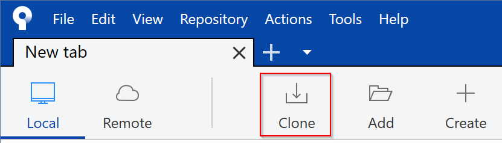

Next simply enter the link to git repository (https://GitHub.com/adam-p/markdown-here), either a web URL or folder. It's probably a good idea to setup a default folder where you want to Clone Repositories in the options.

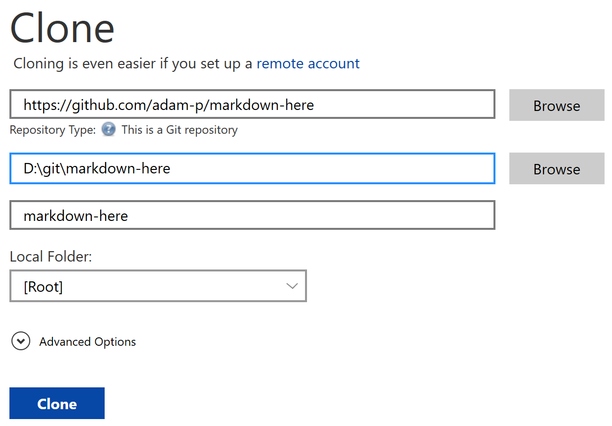

The you should now be presented with the main screen:

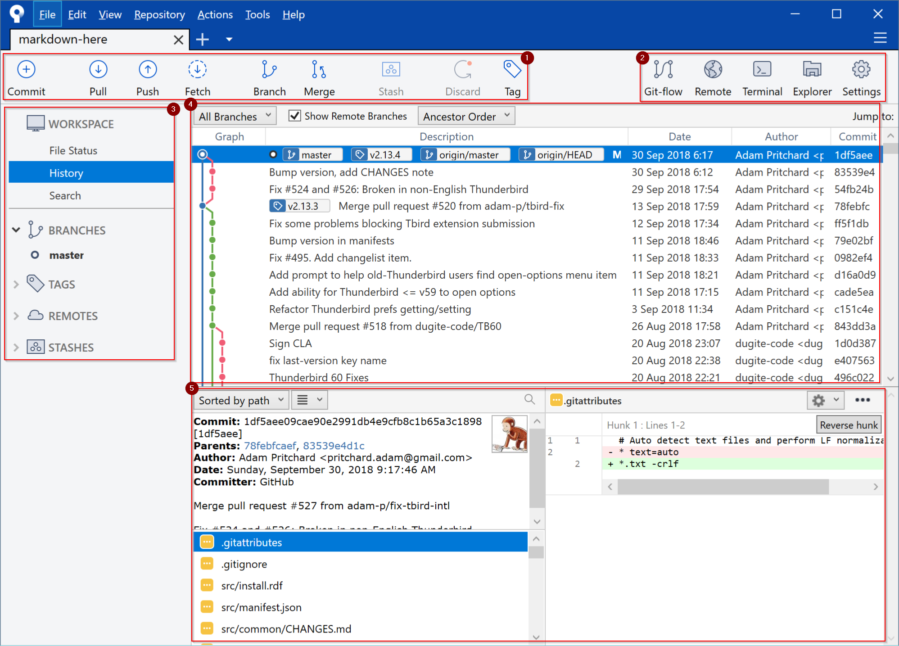

The main components are:
1. **Common Actions**: The top toolbar contains the most common git actions you tend to do. Many are available with right clicking on a Commit.
2. **Handy Shortcuts**:
    * Remote: This will open the repository in an external viewer, this usually means opening up the link in a web browser.
    * Terminal: This will open up a bash style terminal in you local folder. This is useful when you have to run advanced commands.
    * Explorer: Opens your local folder in Windows explorer. I use this a lot more than you would think.
3. **Repository Info**: The left panel contains all the information about your repository, which local branches you have, views of the remotes you have bound (yes you can have multiple).
4. **History**: Personally I think this is one of the main reasons to use a visual client for Git. Being able to see the history of a Repository in this way can be very enlightening. It's basically taking a tool like Perforce's Revision Graph and making it one of you main ways of interacting with your source code. 
5. **Commit Information**: Lastly the bottom panel shows information about the selected commit: The metadata and comment, the files changed and, for each selected file, what changed in each file. 

## Congratulations!
You've officially Cloned your first Repository. You now have the entire history of that Repository locally on your computer with a view to the latest, official, version of it. However before you go trying to change there world, there are a few major concepts that I should over in much more detail.

# Branches

In Perforce we tend to use the term Branch and Fork to mean a specific folder that goes in a different direction. In Game development it's often used to stabilize the game for specific milestone, like Releasing the game, or E3. In that context we often have the source in 2 different places so we can make critical and safe bug fixes to one while more risky development continues in the other.

In Git Branches are a lot more ephemeral. Where a Perforce Branch is a folder that always has '**latest version**', Git is more simply a label to any Commit. Most Repositories will have a '**master**' branch that represents the latest, and often most stable, version of a repository, but even that can move around at the owners whim.

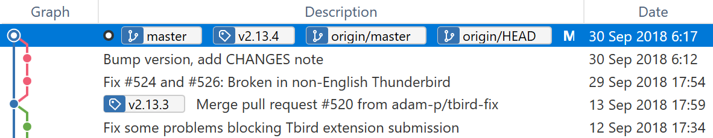

Using the Repository we Cloned earlier, we can see that there are 3 branches (and 2 tags).
* master - This local branch was created automatically when cloning the repository and shows that we are currently at '**latest**'.
* origin/master - This represents where the remote version of this branch is. Since we just cloned we're at the same place but this can change very quickly.
* origin/HEAD - This is usually synonymous with origin/master. However HEAD locally just means 'where you are now'. You can get into a state where you 

## Creating a Branch

To make a new Branch, simply right click on any commit and select the Branch option. In the resulting dialog you can call it whatever you like. We're going to use the commit tagged with **v2.13.3** and call it test_branch.

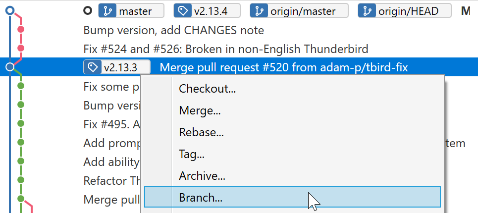
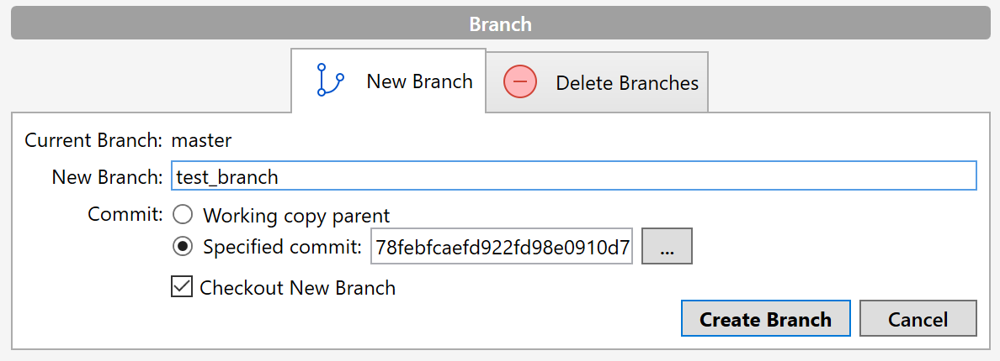
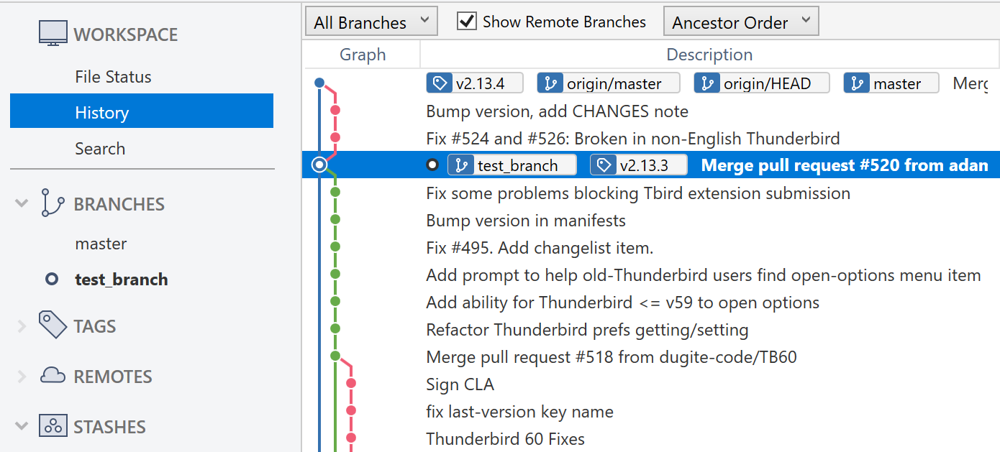

Now we can see that we have a new Branch in the left panel and in the History Graph. By using the default options we automatically Checked-out the new branch as well. The magic part of Git just happened and you probably didn't even notice. You local files have changed to reflect the state of the Repository at this Commit. One of the advantages of Git is being to quickly move between different file states in the same folder. I hope I can show just how powerful this concept it.

## Changing Branches

For now it's enough to know that changing between local Branches is as simple as double clicking the branch on the left or in the history. The one caveat is that Git won't let you change branches if you have local changes. You will have to either Commit or Stash and local changes manually, however, at the time of writing there is a feature request to have Sourcetree automatically stash your changes the same way Git Desktop does.

## Sharing Branches

At this point the new branch you made is only local. To share a branch you perform a '**Push**' the Branch to the remove server. If the Branch doesn't exist yet it will create a new one. If the Branch already exists, and your local changes are additive only, it will update the remove Branch to match your local state.

We are not going to be pushing anything in this article, and I doubt you could even if you wanted to. Nearly all public Repositories are read-only and you need to use Pull Requests for the Maintainer to review and accept your changes.

**Advanced**: Later, when you're more comfortable, you can use the option to '**force push**' a Branch. This will overwrite a remote branch with your local state. This might sound scary, and it can be, but there are plenty of times where makes sense. You can enable the ability to force push in the options.

# Making Changes

Git does not have an equivalent to Perforce Checkout. The word has a completely different meaning. In Git you make changes by simply.... making changes. Git works by constantly watching your filesystem and showing you the difference between your local files and your currently Checked-out branch. Let's give it a shot.

Simply use the '**Explorer**' button and start changing some files (except anything in the .git folder, assume there are dragons in there). For this example I'm changing the README.md file in the root folder. After making some edits and saving the file we can see that the state of Sourcetree has changed.

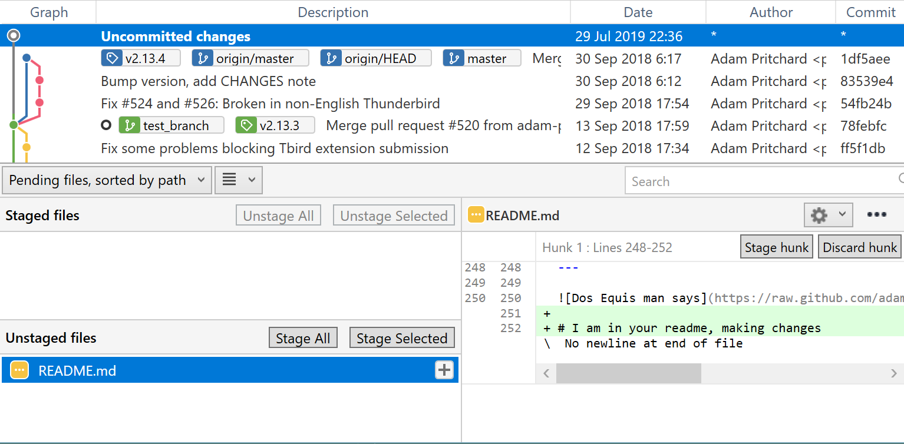

The history graph now shows that we have '**Uncommitted changes**' ahead of our Branch. The Commit information at the bottom shows that the README.md file has changed and even what was changed. Let's take this a little further and change some more things.

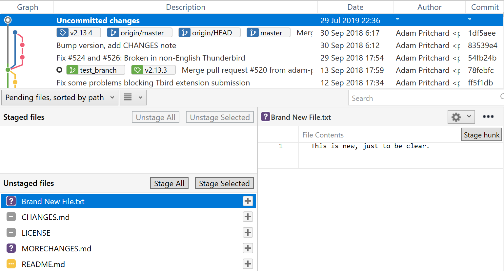

Now I've deleted a file, renamed another one and added a third one. At any time we can go back to Sourcetree and see what changes we've made. This is the equivalent to have a live version of '**Reconcile offline changes**' running at all times. You no longer have to manage your file state like in Perforce, you just keep making changes and worry about how to commit them later.

From here you can do the usual things like reverting changes and deleting locally added files. More interestingly you can use this interface to revert just parts of files. Simply click the lines you want to change and select '**Discard lines**' or revert whole blocks by selecting '**Discard hunk**' (A *hunk* is simply a block of lines that Git decides are close enough to be related).

## Committing Changes

Now that we've made a bunch of changes, let's Commit them to our Branch. To Commit files we have to '**Stage**' them first. There's a plethora of ways you can stage changes. You can simply '**Stage All**' to move everything to the Staging Area, or select a single file to Stage. With a file selected you can even Stage specific Hunks or Lines as well. This can be useful to break changes apart into logical parts, or to Commit simple fixes separately from other work-in-progress changes.

For now we're just going to Stage All, but I encourage playing around. The only destructive option you can really do here is to Discard, so you can experiment with exactly what you want to commit.

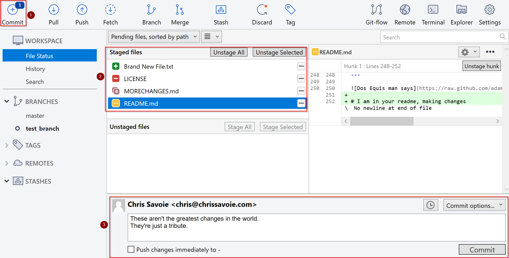

After Staging the changes, I also switched over to the File Status view and a lot has changed.
1. You can see a hint in the top left about how many files we have pending.
2. We see the files that are ready to commit. Git even recognized that a file that was deleted and new one that exists are the same and marks it as a rename.
3. We have an read to write our Commit message. There's plenty of information on [how to write good messages](https://chris.beams.io/posts/git-commit/), here's what I'm currently using:

```
[Category or Feature] Primary problem that this change is solving
* Any additional important information about this change
* Like other bugs being fixed or reasonings behind changes that don't belong in code comments.
```

## Pulling the trigger

At this point we're ready to Commit our changes. Under the Commit message we can check the option to automatically push this change to the remove Repository. We're going to leave this unchecked since we're only working locally, but it's nice to use from time to time. I often find myself changing between using it and not using it, depending if I'm pushing a quick change or preparing multiple Commits for a single push.

So it's time to click the button, Commit those changes!

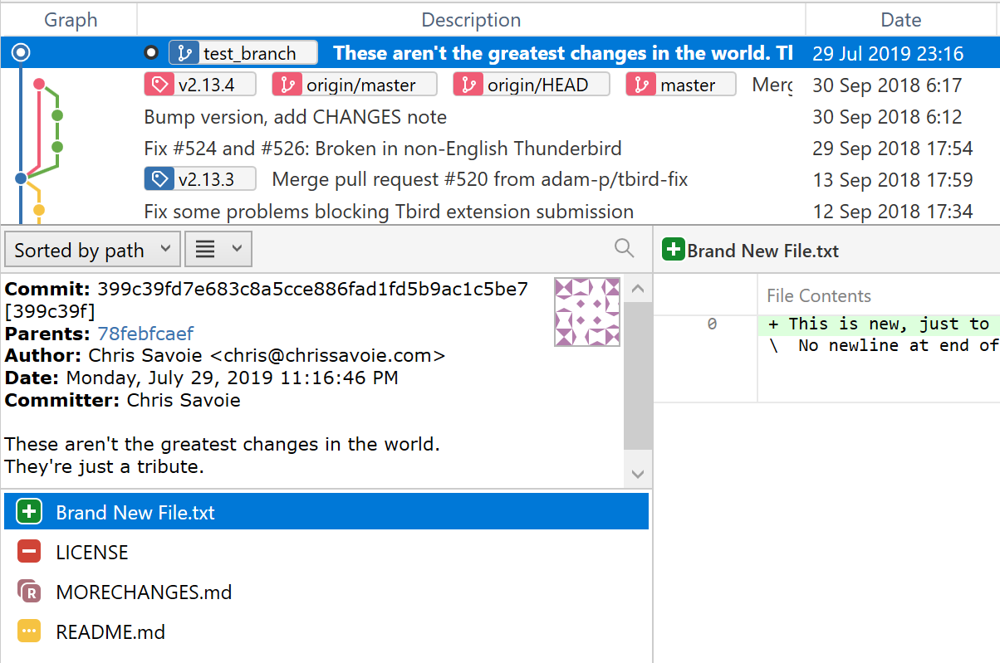

That's it. You're changes are now in Git! However they are still only local, so let's get them online!

# Sharing is Caring: contributing to Open Source

So now that we've covered how to get someone else's repository, and how to make local changes, it might be a good time to go over some useful ways of contributing to Open Source. I'm not going to cover how to create your own repository, that's just a [few clicks on GitHub](https://help.GitHub.com/en/articles/create-a-repo) or [directly in Sourcetree](https://confluence.atlassian.com/get-started-with-sourcetree/create-a-local-repository-847359103.html), and following the standard cloning process.


## Forks

Generally you're not going to be allowed to push directly into someone else's repository. You need to get your change into the Open Source ecosystem so that you can setup a Pull Request. This is where Forks come in.

A Fork is basically just a copy of a Repository. It's not actually a Clone of the files but more a carbon copy of the metadata. When you create a Fork for the first time you will have all the same Branches, Tags and history as the original Repository, except it's yours now. Since you own the Fork you can literally do whatever you want without fear of affecting the original. Even you get it into an untenable state, you can always just delete it and restart with new Fork. Being able to abandon work and start over is a bit of a Common theme with Git.

Creating a Fork differs depending on the platform, but I'll attempt to explaining the overly complicated process on GitHub. First, create a GitHub account, then....

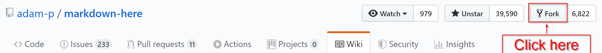

...

Yup, that was it. You are now the proud owner of a copy of [markdown-here](https://GitHub.com/adam-p/markdown-here/wiki/Markdown-Cheatsheet).

Now is the actual complex part. Normally you could have Forked first and Cloned your own Repository and that would have been sufficient. Instead we Cloned first and even Committed some work before deciding to Fork. Fortunately there's a way to fix this up without having to redo all of our hard work. First step go into the repository settings.

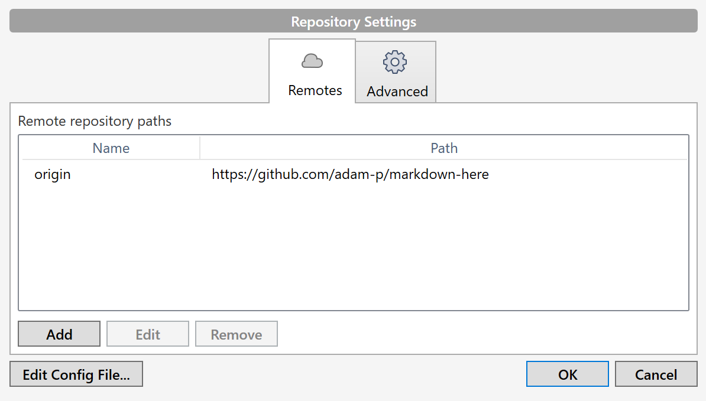

Before adding our newly Forked Repository, you want to make sure that the original one is not the default since our own Repository should be the default. The name '**origin**' is bit special in git. I like to call the original Repository '**Prime**' to distinguish it.

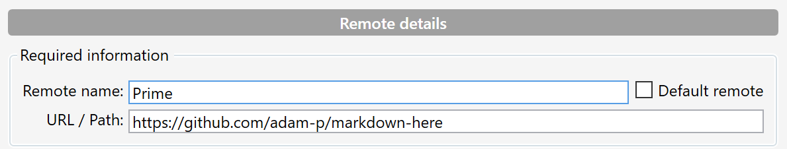

Then just add your newly Forked Repository and mark it as the default. It should now be at 'https:<span>//GitHub</span>.com/&lt;username&gt;/markdown-here'. You will also want to put in your login info so that you will be able to Push.

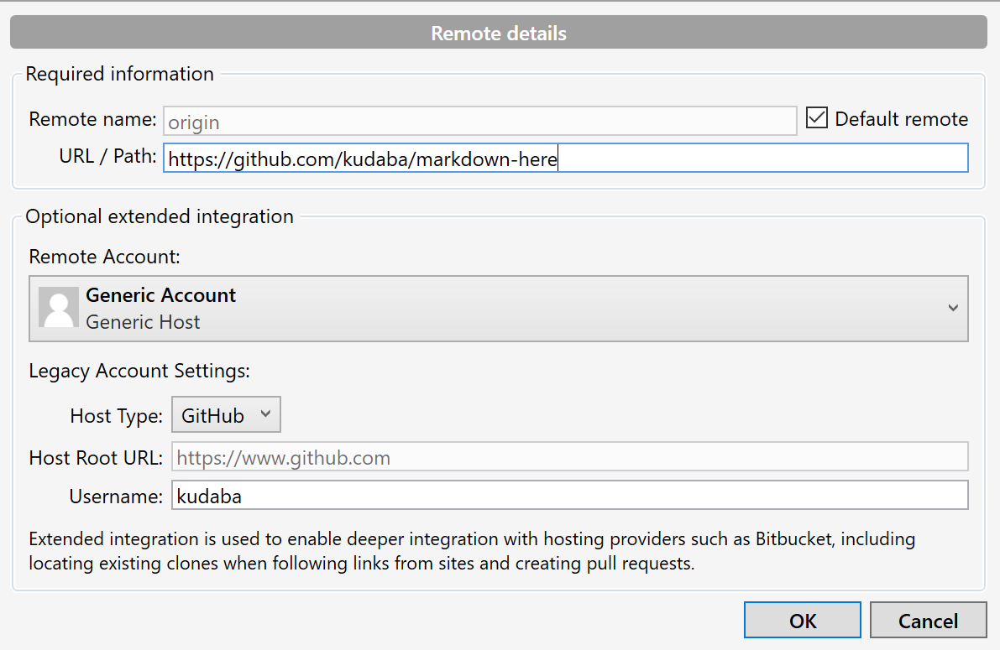

When you return to the main window you will probably notice that... well... not much has changed really.

## Fetch! good boy

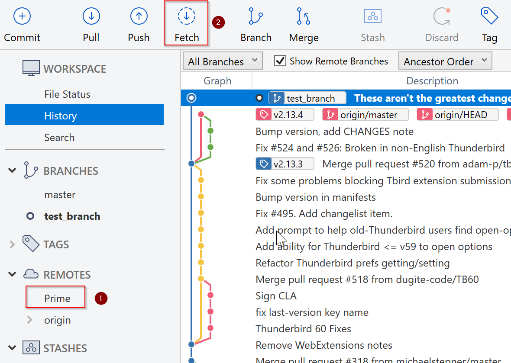

The only subtle difference is that now there are two entries under Remotes (1). One of them is not expandable, this is where we can use the Fetch command(2).

Fetch is actually a quite simple command. It just grabs the latest information from remove servers and reflects that in your local state. Sourcetree will do this automatically from time to time, but sometimes things can get out of sync. If you ever feel like something is missing always try a Fetch first.

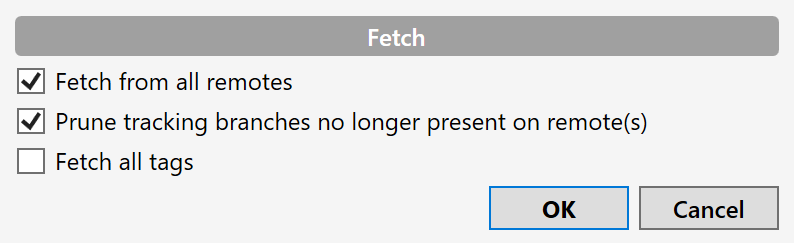

The one interest bit here that I leave on the option to "Prune tracking branches". As a Repository evolves branches tend to come and go. Without this option enables you will slowly accumulate all branches even after they've been deleted from server. This option will keep things nice and tidy.

## Repository gardening

If you expand both Remote Repositories, '**Prime**' and '**origin**', you'll probably notice a lot of branches, and a lot of them are duplicates. This is generally fine, but if you want you can actually just go ahead and delete all the excess branches from '**origin**'. You own this version of the Repository, so you can do whatever you want!

| Before | After |
|:---:|:---:|
|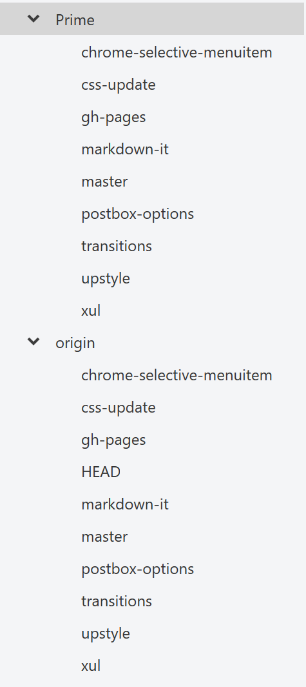|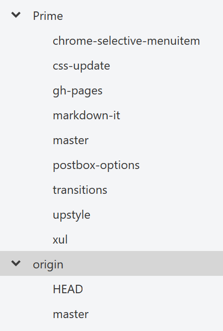|

Much cleaner. If you do ever want to work on one of those branches, you can get it back by just doing a Checkout on the '**Prime**' version of the branch and Pushing it to your repository.

# Push time

Now that we're all connected to a Repository that we fully own and control, we can push our wonderful changes and make them available to the world. If you haven't strayed from this article then the '**test_branch**' that we made earlier should still be checked out. If not you can just double click it to make it active. Now we're going to press the big scary Push button.

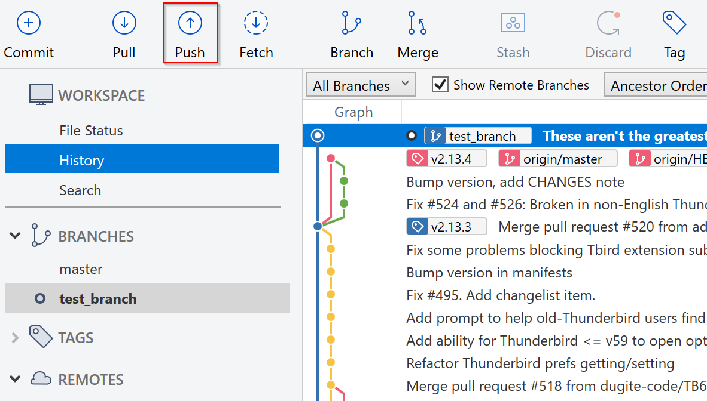
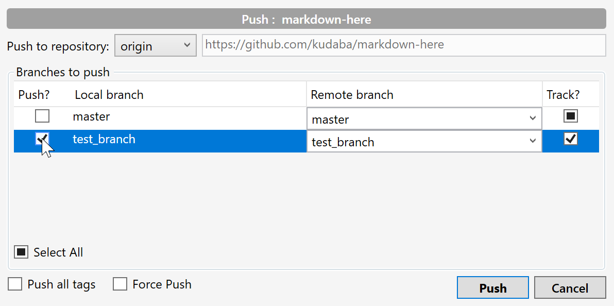

In the resulting dialog, just click the the checkbox next to '**test_branch**'. If a branch already exists on the remote this will usually be checked by default. This dialog can also be used to push multiple branches at once, or even to push to branches that don't match names.

If you've clicked the button then..

## !!Congratulations!!

You've now Pushed changes out into the wild world for everyone to see! That is, unless you made your Fork private, then it's just in the cloud, which is still very nice since you can now access your work from anywhere.

# Sharing 2.0: Pull Requests

Even though your changes are now public (or private) domain, there's still a good change no one will really see them. And even if they do, I don't know how often people look at random Forks of a Repository. If you want to truly share your changes with the world then you will want to get them back into the original Repository. This is the essence of a Pull Request, you are literally Requesting that the original Maintainers Pull your changes into their branch.

There are a few things you want to keep in mind when making a Pull Request
1. Read CONTRIBUTING<span/>.md - Most active project will have one of these at the root alongside README.md, LICENSE and other important information. This file with explain and processes, requirements, or rules you will need to adhere to. It sounds a bit scary, but it's mostly to be clear about ground rules and help to prevent abuse.
2. Review existing Pull Requests - Like a good forum post, make the effort to double check that someone hasn't already made a request for similar changes.
2. Don't make a Pull Request from your '**master**' branch - or any branch who's name is already used. It's a good idea to make a new branch for a pull request with a simple name that's related to the changes. Ideally it should contain a small set of highly focused changes that are fixing one issue or related to implementing one feature. Keep it simple until you get more experience and become more actively involved in a project.
3. Write as much information as you can in the Pull Request. It supports Markdown, and GitHub has embedded features for referencing Issues, Pull Requests, Commits and other information related to your change if relevant. Simply write the short commit id (i.e. 399c39f) or relate number (i.e. #123). You can use this space to explain why you think the changes are important, or how you discovered a bug.

If you're ready to see what it looks like to make a pull request you can head over to your GitHub page. Remember you can use the '**Remote**' button in the top right corner as a shortcut. This button links to the '**default**' Repository which should be yours now. When you get there you should see the following:

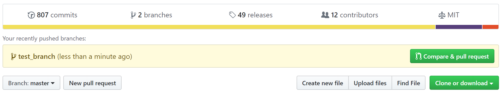

GitHub is really good as paying attention to what you're doing. You will see this message for a short while after Pushing change to a Branch. Now we can click the '**Compare & pull request**' button to start the Pull Request process. Don't worry though, we're just taking a peek into what it looks like, not actually making the request.

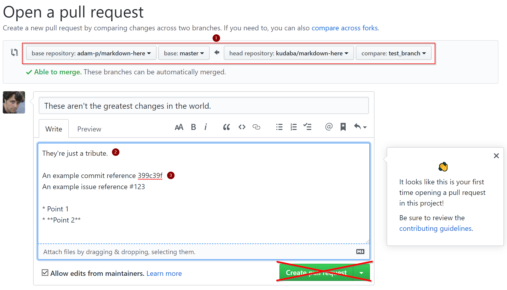

On this screen there are a few things to note.
1. Source and target Branches - You can control which Branch your making a Pull Request from and which Branch you want the Pull Request to merge into. If the Branch is new then it will default to '**master**' but this might not always be the right target. Many project use '**master**' as the latest **Stable** Branch and will do active development in a different Branch. Keep any eye out for this.
2. Automatic message - GitHub will use your Commit messages to get this started for you. While it's ok to repeat information from the Commits themselves, you often want to go into much more detail here. It's very often that the reason for making a change is entirely clear from the core or appropriate for a Commit message, so you can use this space to explain why you think this change will benefit the project.
3. Here's a couple examples of references and Markdown usage.
4. DON'T PRESS THE BIG GREEN BUTTON - You can always close out the request but it's best not to annoy the Maintainers.

# Review

I hope this was a good introduction into the world of Open Source using Git. Git can be very confusing, but when you get used to it then it can also be liberating when compared to Perforce. I'm definitely not advocating for one over the other, I feel both have their strong points, but it's good to get a different perspective and Git is definitely different.

What I've covered today is really just the basics of get. It should get you up and running, contributing, and sharing, however there's a lot more that Git can do and I hope to cover it in future articles.

What we've done today is:
- [Cheat Sheet](#cheat-sheet)
- [Cloning a Repository, My First Branch](#cloning-a-repository-my-first-branch)
- [Branches](#branches)
- [Making Changes](#making-changes)
- [Sharing is Caring: contributing to Open Source](#sharing-is-caring-contributing-to-open-source)
- [Push time](#push-time)
- [Sharing 2.0: Pull Requests](#sharing-20-pull-requests)
- [Review](#review)

Next time we'll cover:
- Getting Latest (Pull)
- WTF Is Rebase??
- Advanced Branching (Reset)
- Submodules
